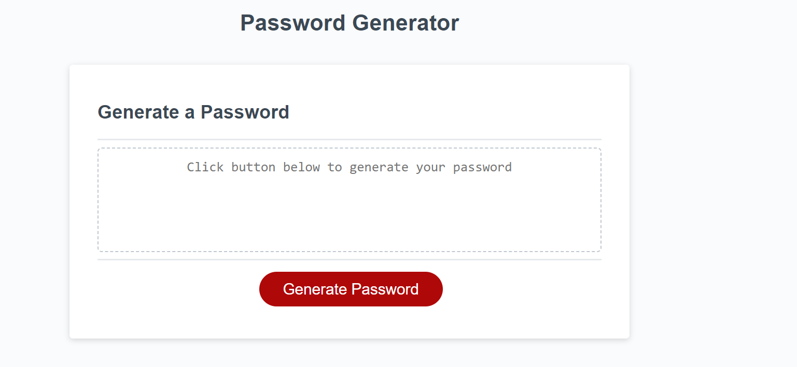

# Password-Generator

## Description

This repository is for a password generator app to help people come up with secure passwords. By clicking the 'Generate Password', users can customise a password by selecting whether they uppercase, lowercase, special character and numbers in their password or not, then the program will generate a password based on those inputs. 

## Usage  

The project has been deployed on GitHub Pages and can be accessed using this link:  

[Password Generator](https://dumisilem.github.io/Password-Generator/) 

The page should look something like this:

 

**To use the app:**  
1. Access the link above
2. Click the 'Generate Password button' as seen above
3. This should bring up series of alerts to customise your password:  
    - select the length you want
    - the next series of alerts will be to customise your password. Click OK if you want the choice, and Cancel if you do want choice e.g. you do not want uppercase letters.
4. The password should then appear in the text area. 

## Credits
N/A

## License
N/A

